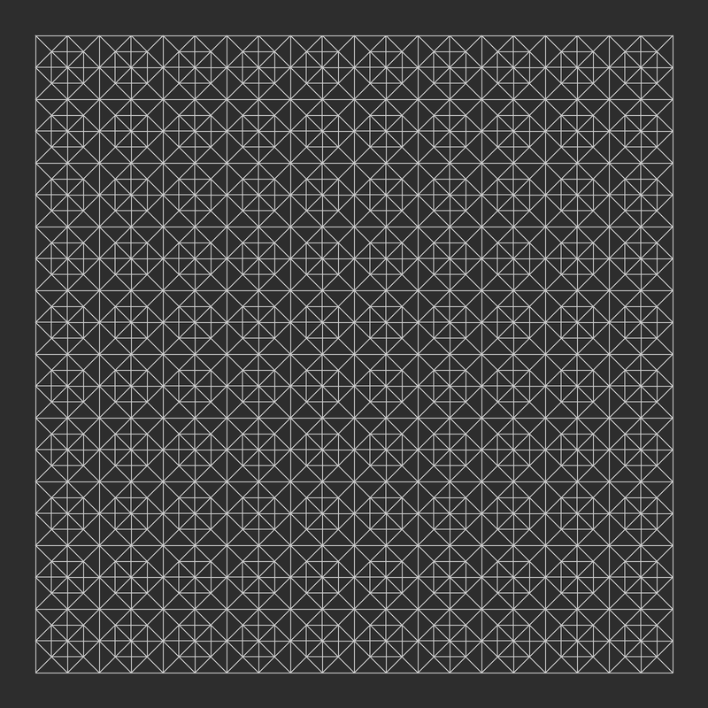
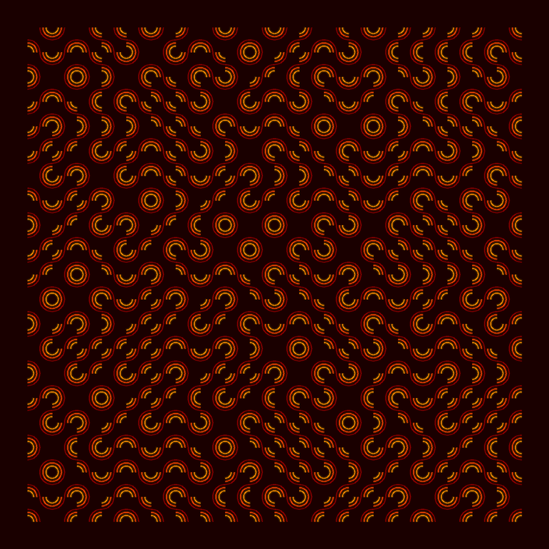

# Tile Filling Visualizer

A Python GUI application for generating stunning geometric tile-filling patterns. Built for artistic exploration with 8 pattern types, 12 color palettes, and real-time parameter control.

## Gallery

### Decorated Grid
Grid cells filled with layered geometric decorations — diagonals, diamonds, and radial lines.



### Truchet Tiles (Cyberpunk)
Randomly oriented quarter-circle arcs create emergent flowing curves. Shown with gradient coloring and glow.


### Islamic Star (Gold)
Eight-pointed interlocking stars with geometric connections between cells.


### Penrose Tiling (Ocean)
Aperiodic tiling based on golden ratio subdivision — never repeats, always symmetric.


### Hexagonal (Sunset)
Honeycomb grid with inner hexagons and star decorations.


### Sierpinski (Neon)
Fractal triangle subdivision — self-similar at every scale.


### Voronoi (Arctic)
Organic cell tessellation with Lloyd relaxation for even spacing.


### Truchet Multi-Arc (Fire)
Concentric arc variant of Truchet tiles for denser, richer patterns.



## Quick Start

```bash
pip install Pillow
python main.py
```

Requires Python 3 and tkinter (included with most Python installations).

## Features

- **8 Pattern Types:** Grid, Decorated Grid, Islamic Star, Penrose Tiling, Truchet Tiles, Voronoi, Hexagonal, Sierpinski
- **12 Color Palettes:** Monochrome, Blueprint, Cyberpunk, Ocean, Sunset, Forest, Gold, Neon, Minimal White, Pastel, Fire, Arctic
- **Rendering Effects:** Glow, gradient coloring, adjustable line width
- **Anti-aliased output** via 2x supersampled rendering
- **Export:** Standard PNG and hi-res 4x PNG at 300 DPI
- **Real-time controls:** Every parameter adjustable via sliders with live preview

## Adding New Patterns

1. Create a file in `patterns/` with a class inheriting `BasePattern`
2. Implement `get_params()` (parameter slider definitions) and `generate()` (returns drawing commands)
3. Register it in `patterns/__init__.py` under `PATTERN_REGISTRY`
