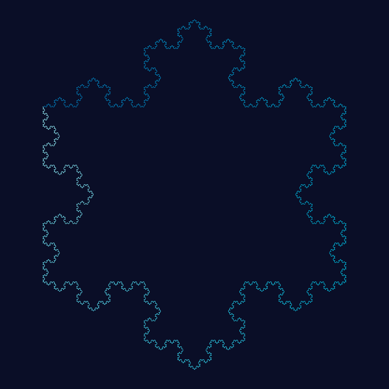
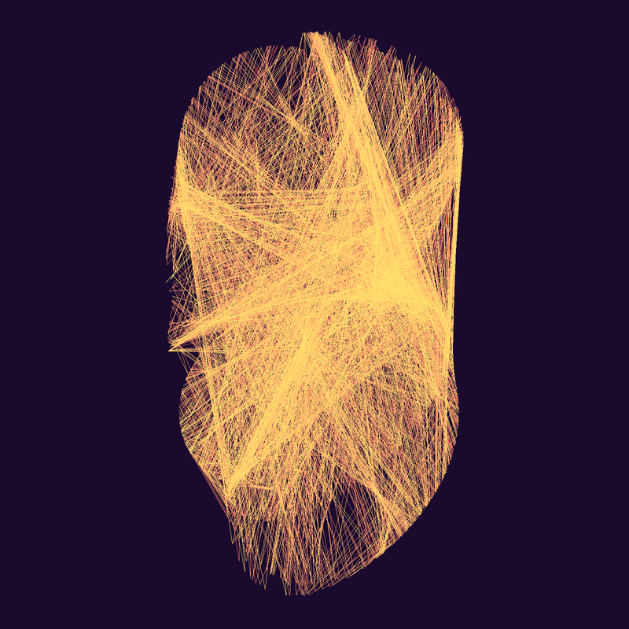
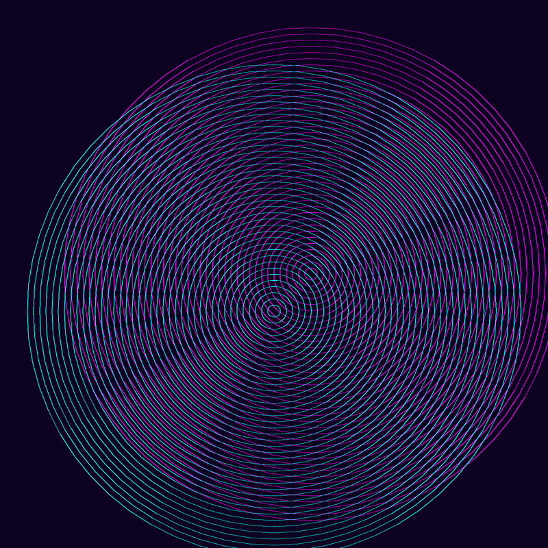
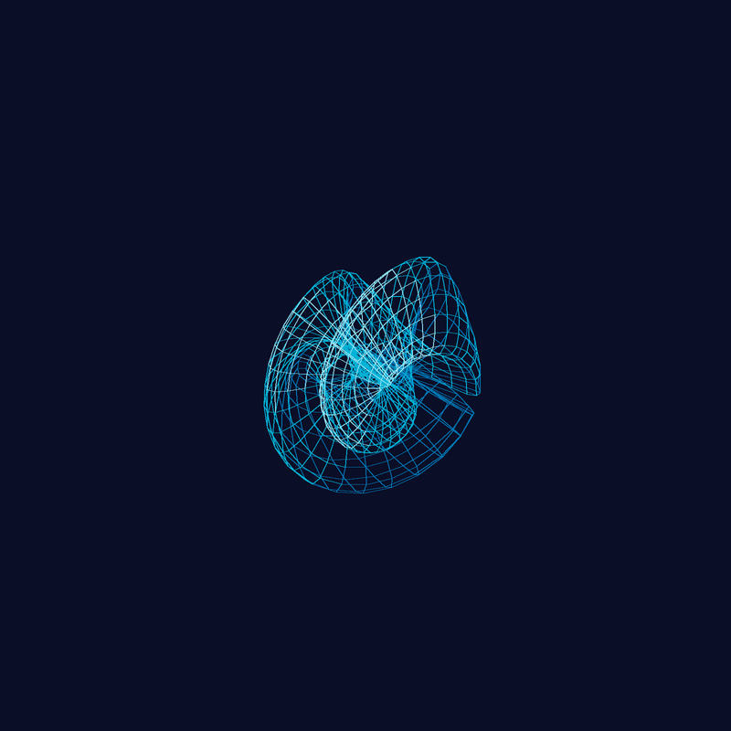

# Tile Filling Visualizer

A Python GUI application for generating stunning mathematical and geometric art. 17 pattern types, 12 color palettes, 3D wireframe surfaces, post-processing effects, and real-time parameter control.

## Gallery

### Classic Tilings

**Decorated Grid** — Grid cells with layered geometric decorations: diagonals, diamonds, radial lines.


**Truchet Tiles (Cyberpunk)** — Randomly oriented quarter-circle arcs create emergent flowing curves.


**Islamic Star (Gold)** — Eight-pointed interlocking stars with geometric connections.


**Penrose Tiling (Ocean)** — Aperiodic golden-ratio tiling that never repeats.


**Hexagonal (Sunset)** — Honeycomb grid with star decorations.


**Sierpinski (Neon)** — Fractal triangle subdivision, self-similar at every scale.


**Voronoi (Arctic)** — Organic cell tessellation with Lloyd relaxation.


**Truchet Multi-Arc (Fire)** — Concentric arc variant for denser, richer patterns.


### Mathematical Curves

**Hilbert Space-Filling Curve (Cyberpunk)** — A single continuous path that fills a 2D region. Gradient coloring reveals the curve's traversal order.


**Spirograph (Neon)** — Overlaid hypotrochoid curves from rolling-circle geometry.


**L-System Plant (Forest)** — Fractal branching tree from recursive string rewriting.


**L-System Koch Snowflake (Ocean)** — Classic fractal coastline curve.



**Clifford Attractor (Sunset)** — Chaotic trajectory from a simple nonlinear dynamical system.



**De Jong Attractor (Cyberpunk)** — Another chaotic system with butterfly-like structure.


**Moire Interference (Cyberpunk)** — Overlapping concentric circles create emergent patterns.



### 3D Patterns

**Wireframe Torus (Cyberpunk)** — Parametric 3D torus with perspective projection and depth-based coloring.


**Wireframe Klein Bottle (Ocean)** — The famous non-orientable surface rendered as a wireframe.



**Trefoil Knot (Neon)** — 3D mathematical knot with gaussian bloom and vignette.


**Isometric Cubes (Pastel)** — 3D cube grid with wave-based height variation.


### Advanced Patterns

**Chladni Figures (Gold)** — Nodal line patterns from vibrating plate wave equations.


**Reaction-Diffusion (Arctic)** — Gray-Scott model organic Turing patterns as contour lines.


### Post-Processing Effects

**Kaleidoscope + Gaussian Bloom** — Any pattern can be transformed with N-fold symmetry and bloom effects.


## Quick Start

```bash
pip install Pillow
python main.py
```

Requires Python 3 and tkinter (included with most Python installations).

## All 17 Pattern Types

| Category | Patterns |
|----------|----------|
| **Classic Tilings** | Grid, Decorated Grid, Islamic Star, Penrose, Truchet, Voronoi, Hexagonal, Sierpinski |
| **Mathematical Curves** | Space-Filling Curves (Hilbert/Peano/Gosper), Spirograph, L-System, Strange Attractors, Moire |
| **3D Patterns** | Isometric Cubes, 3D Wireframe (Torus/Klein/Trefoil/Sphere/Mobius) |
| **Advanced** | Chladni Figures, Reaction-Diffusion |

## 12 Color Palettes

Monochrome, Blueprint, Cyberpunk, Ocean, Sunset, Forest, Gold, Neon, Minimal White, Pastel, Fire, Arctic

## Rendering & Effects

- **Line rendering:** Adjustable width, glow effect, gradient coloring
- **Anti-aliasing:** 2x supersampled rendering
- **Post-processing:** Kaleidoscope symmetry (2-12 folds), Gaussian bloom, Vignette
- **3D rendering:** Perspective/isometric projection, depth-based coloring
- **Export:** Standard PNG and hi-res 4x PNG at 300 DPI

## Adding New Patterns

1. Create a file in `patterns/` with a class inheriting `BasePattern`
2. Implement `get_params()` (parameter slider definitions) and `generate()` (returns drawing commands)
3. Register it in `patterns/__init__.py` under `PATTERN_REGISTRY`
